## Side Project: Tile-Task API (Django REST Framework) 
<a href="#" target="_blank">:arrow_right: Preview</a>  

### Introduction 

The project is focused on creating **task** objects that users must **complete**, and grouping these tasks in a container called a **tile**. Each tile has a launch date and a **status**, which can be **live**, **pending** or **archived**. Tasks can only belong to a single tile, and each task has a title, an order field, a description, and a type, such as **survey**, **discussion**, or **diary**. 

> No frontend work is required for this task.

<p align="center">
  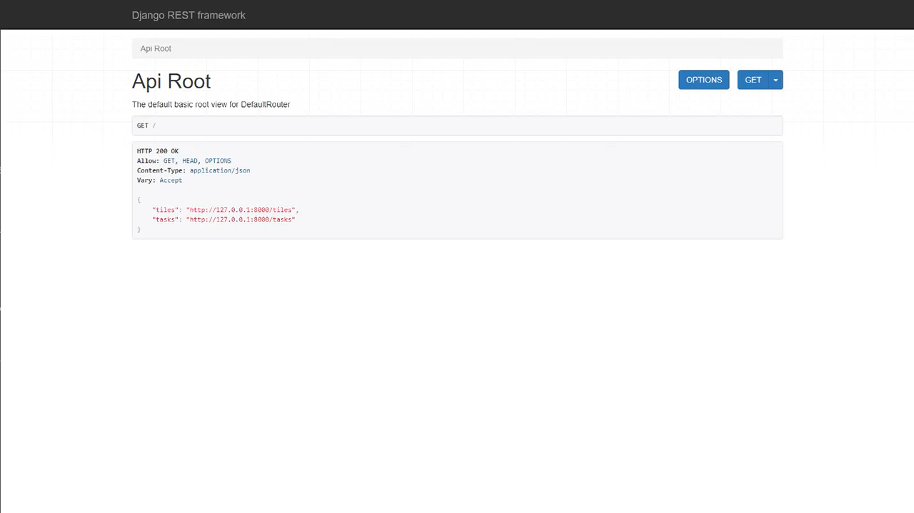
<br>
<i>1. The overview of Tile-Task API (Django REST framework)</i></p>


<p align="center">
  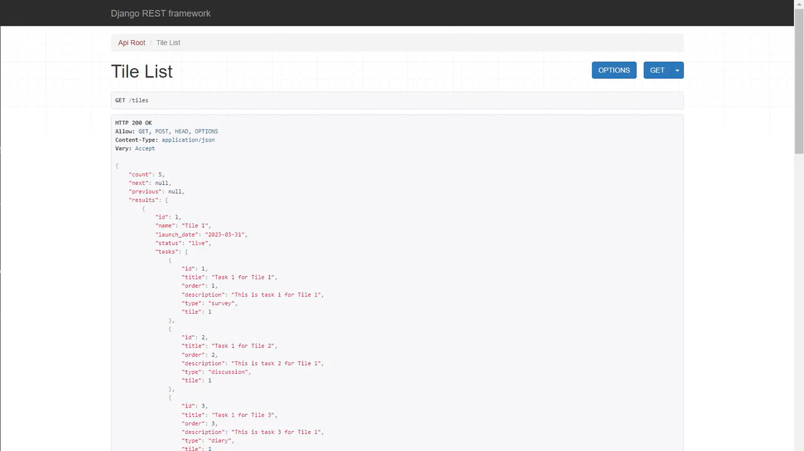
<br>
<i>2. Tile List API (Django REST framework)</i></p>


<p align="center">
  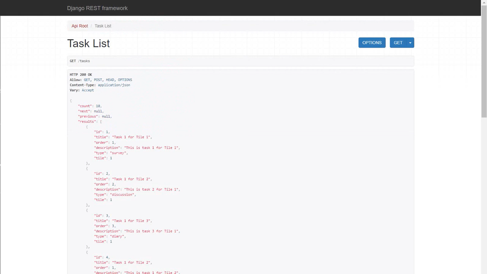
<br>
<i>3. Task List API (Django REST framework)</i></p>

### Getting Started

These instructions will get you a copy of the project up and running on your local machine for development and testing purposes.

####  Prerequisites

- **Python** 3.10 or later
- **Django** 4.1 or later
- Additional packages: Django REST Framework, Yet another Swagger generator


#### Installation

I recommend you follow <a href="https://docs.djangoproject.com/en/4.1/intro/tutorial01/">Django's tutorial</a> to start your project and application first and then take my repository as your reference.

1. **Install** Python, Django and the required packages on your local machine. Follow the introductions to install <Python href="https://www.python.org/" target="_blank">Python</a>

```
pip install django
pip install djangorestframework
pip install drf-yasg
```
2. **Create** a Django project

```
django-admin startproject project
```

3. **Start** a development server to see the Django function properly

```
python manage.py runserver
```

4. **Create** an application **tile-task**
```
python manage.py startapp tile_task
```

5. **Apply** the migrations to build up models
```
python manage.py makemigrations
python manage.py migrate
```

6.  **Clone** the repository for your reference
```
git clone https://github.com/cwchan0212/self-django-tile-task.git
```

7. **Navigate** to the project directory and copy the files according to the following file structures. Take a reference to my **settings.py** and **views.py**. Once you start your project, it will generate a **Secret Key** in the settings.py. Please keep it **secret**. 

> Note: The **Secret Key** is removed.
```
cd project
```

### File Structure
```
project/
├─ project/
│  ├─ asgi.py
│  ├─ settings.py * 
│  ├─ urls.py * 
│  ├─ wsgi.py
│  ├─ __init__.py
├─ tile_task/
│  ├─ admin.py *
│  ├─ apps.py
│  ├─ models.py * 
│  ├─ serializers.py #
│  ├─ tests.py
│  ├─ urls.py #
│  ├─ views.py *
│  ├─ __init__.py
db.sqlite3
manage.py
README.md
requirements.txt
```

> Note: The configuration files are marked with an asterisk (*) and those that are newly created are marked with a sharp (#). Please refer to the source codes above.


### Model

#### Tile
The **Tile** model has several fields: 
* id as primary key (generated automatically by the database)
* name
* launch_date
* status (live, pending, archived)

The **id** field is set as the **primary key**, which means that it is unique for each tile and will be used as the identifier for the tile. 

#### Task
The **Task** model also has several fields: 
* id as primary key (generated automatically by the database)
* title
* order
* description
* type (survey, discussion, diary)
* tile as the foreign key of Tile
 
The **id** field is set as the **primary key**, which means that it is unique for each task. It also has a **foreign key** called **tile**, which is a reference to the id (tile) primary key field in the Task model. This establishes a one-to-many relationship between the Tile and Task models, as one tile can have multiple tasks.

### Usage

1. Start the development server:
2. Open a web browser and navigate to `http://127.0.0.1:8000/` to navigate the Django REST framework portal to simply perform CRUD of Tile and Task with the following endpoints.

3. The user can navigate to <a href="https://www.postman.com/" target="_blank">Postman API platform</a> to perform CRUD of Tile and Task with the following endpoints under **ViewSets** of the Django REST framework.

#### Tile
- **READ all** tiles: GET http://127.0.0.1:8000/tiles
- **CREATE** tile: POST http://127.0.0.1:8000/tiles
- **READ** tile: GET http://127.0.0.1:8000/tiles/<int:tile_id>
- **UPDATE** tile: PUT http://127.0.0.1:8000/tiles/<int:tile_id>
- **DELETE** tile: DELETE ttp://127.0.0.1:8000/tiles/<int:tile_id>

<p align="center">
  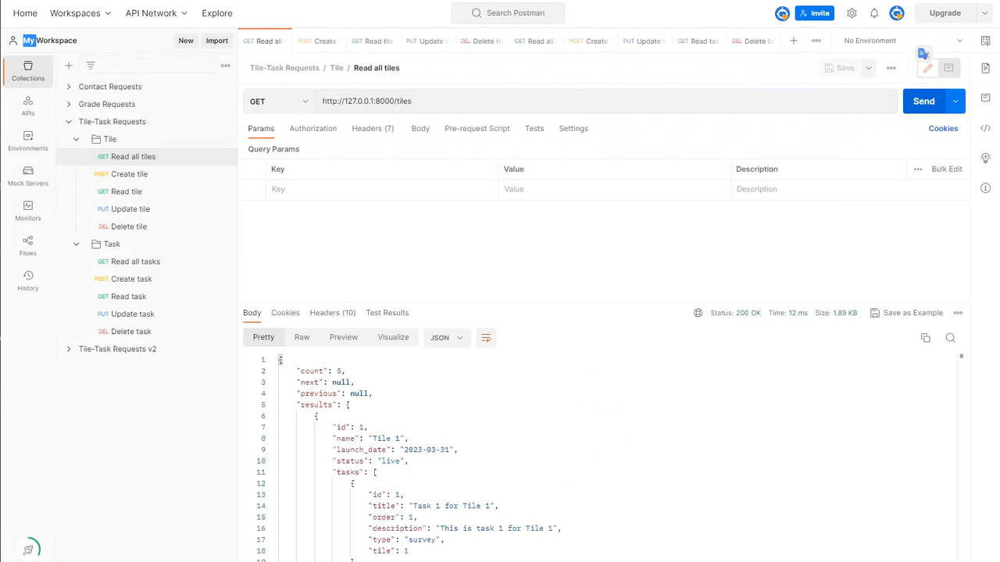
<br>
<i>4. Tile: READ all tiles (GET method) in the POSTMAN API platform</i></p>
    
<p align="center">
  
<br>
<i>5. Tile: CREATE tile (POST method) in the POSTMAN API platform</i></p>


<p align="center">
  
<br>
<i>6. Tile: READ tile (GET method) in the POSTMAN API platform</i></p>

<p align="center">
  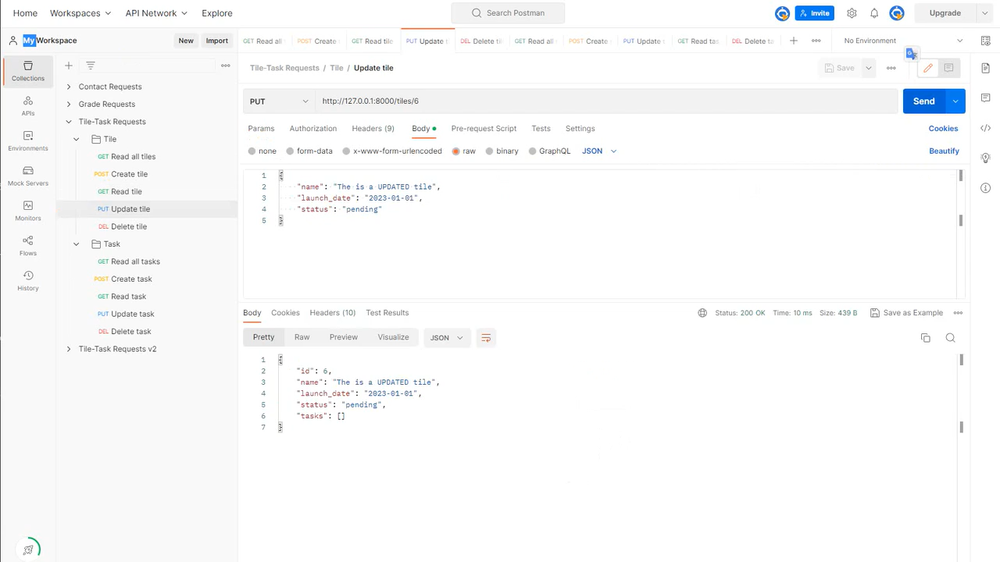
<br>
<i>7. Tile: UPDATE tile (PUT method) in the POSTMAN API platform</i></p>

<p align="center">
  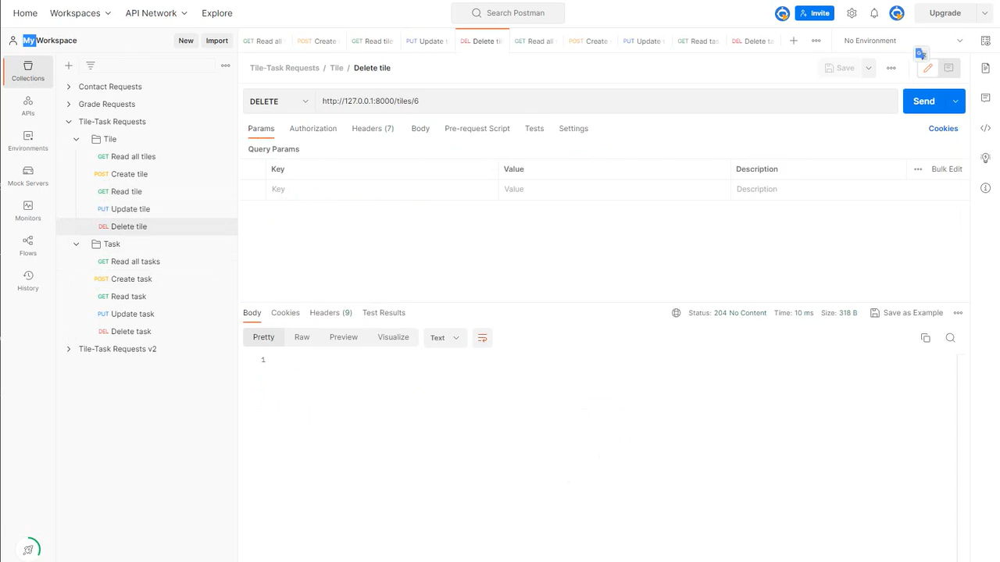
<br>
<i>8. Tile: DELETE tile (DELETE method) in the POSTMAN API platform</i></p>

#### Task
- **READ all** tasks: GET http://127.0.0.1:8000/tasks
- **CREATE** task: POST http://127.0.0.1:8000/tasks
- **READ** task: GET http://127.0.0.1:8000/task/<int:task_id>
- **UPDATE** task: PUT http://127.0.0.1:8000/tasks/<int:task_id>
- **DELETE** task: DELETE http://127.0.0.1:8000/tasks/<int:task_id>

<p align="center">
  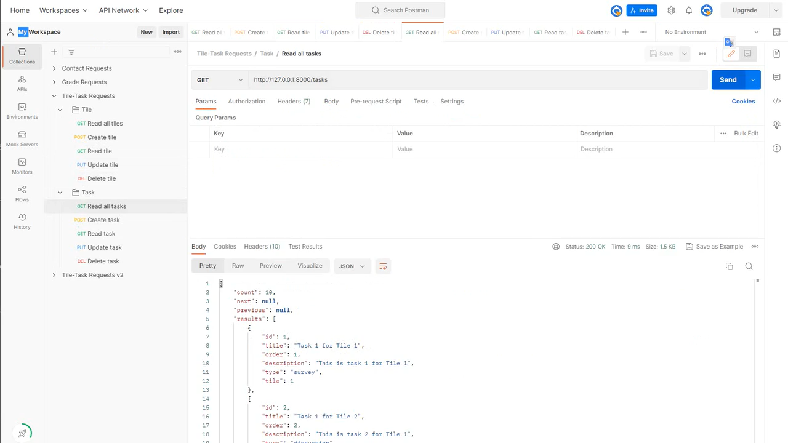
<br>
<i>9. Task: READ all tasks (GET method) in the POSTMAN API platform</i></p>
    
<p align="center">
  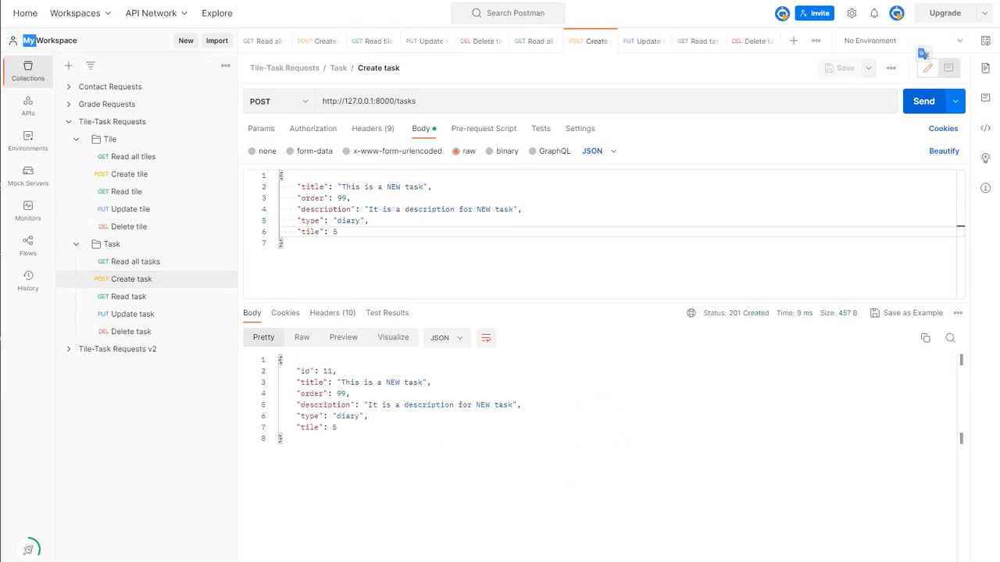
<br>
<i>10. Task: CREATE task (POST method) in the POSTMAN API platform</i></p>


<p align="center">
  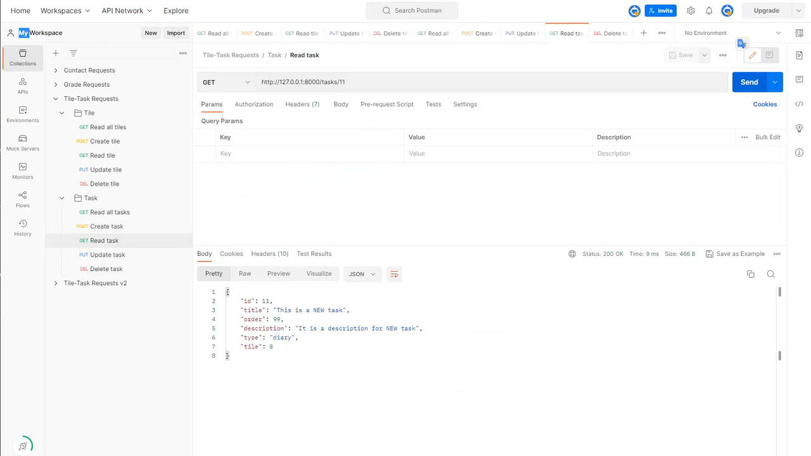
<br>
<i>11. Task: READ task (GET method) in the POSTMAN API platform</i></p>

<p align="center">
  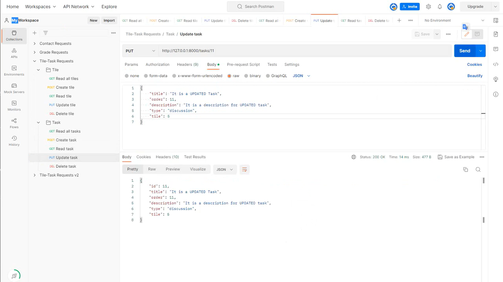
<br>
<i>12. Task: UPDATE task (PUT method) in the POSTMAN API platform</i></p>

<p align="center">
  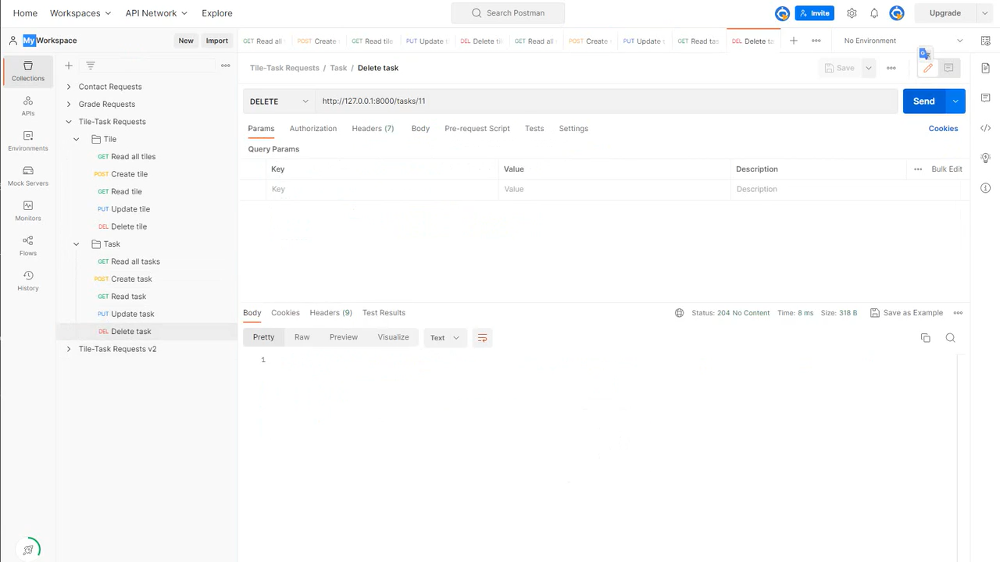
<br>
<i>13. Task: DELETE task (DELETE method) in the POSTMAN API platform</i></p>

 4. Alternatively, the user can use the following endpoints to perform the same CRUD operations.
     **Tile**
    - **READ all** tiles: GET http://127.0.0.1:8000/v2/tiles
    - **CREATE** tile: POST http://127.0.0.1:8000/v2/tile
    - **READ** tile: GET http://127.0.0.1:8000/v2/tile/<int:tile_id>
    - **UPDATE** tile: PUT http://127.0.0.1:8000/v2/tile/<int:tile_id>
    - **DELETE** tile: DELETE http://127.0.0.1:8000/v2/tile/<int:tile_id>

    **Task**
    - **READ all** tasks: GET http://127.0.0.1:8000/v2/tasks
    - **CREATE** task: POST http://127.0.0.1:8000/v2/tile/<int:tile_id>/task
    - **READ** task: GET http://127.0.0.1:8000/v2/tile/<int:tile_id>/task/<int:task_id>
    - **UPDATE** task: PUT http://127.0.0.1:8000/v2/tile/<int:tile_id>/task/<int:task_id>
    - **DELETE** task: DELETE http://127.0.0.1:8000/v2/tile/<int:tile_id>/task/<int:task_id>
  
### API Documentation
This project includes a simple API that allows interaction with the task and tile models. The API is built using Django Rest Framework (DRF) version 3.10 and utilizes appropriate **viewsets** and **serializers** provided by DRF.

> Note: <a href="https://www.django-rest-framework.org/tutorial/6-viewsets-and-routers/" target="_blank">Trade-offs between views vs viewsets</a>
> <p>Using viewsets can be a really useful abstraction. It helps ensure that URL conventions will be consistent across your API, minimizes the amount of code you need to write, and allows you to concentrate on the interactions and representations your API provides rather than the specifics of the URL conf.</p>
> <p>That doesn't mean it's always the right approach to take. There's a similar set of trade-offs to consider as when using class-based views instead of func views. Using viewsets is less explicit than building your views individually.</p>

The user can navigate to check the Tile-Task API documentation at http://127.0.0.1:8000/swagger/ .

<p align="center">
  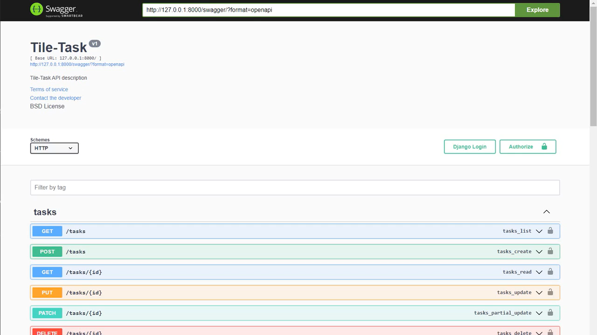
<br>
<i>14. The tile-task API documentation</i></p>

### Conclusion
This project showcases how to use models in **Django** to create a simple yet efficient system for managing tasks and tiles. By using DRF, we were able to create a powerful API that **allows for easy interaction with the models**. We hope this project serves as a helpful example for other developers looking to work with Django and DRF.